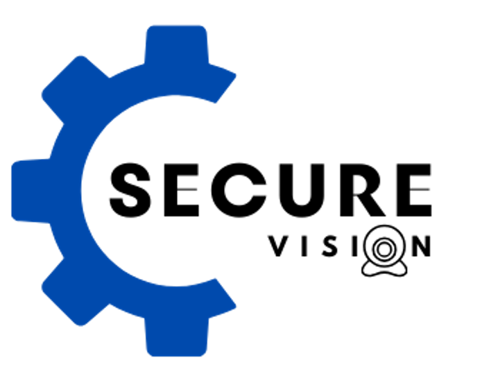
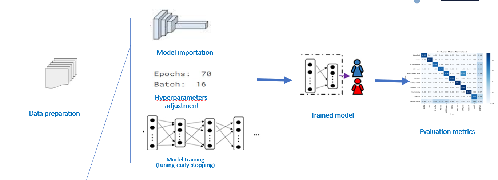

# Secure Vision



## What is Secure Vision?
**Secure Vision** is an intelligent computer vision system designed to enhance industrial safety by detecting the presence of Personal Protective Equipment (PPE) such as helmets, vests, and masks in real-time video streams and pre-recorded footage. This system automates safety compliance monitoring, ensuring that workers are adhering to safety regulations, while instantly notifying supervisors of any violations.

## Why Secure Vision?
In high-risk industrial environments, failure to wear protective gear can lead to serious accidents, injuries, or even fatalities. Traditional manual monitoring of safety compliance is time-consuming, prone to human error, and can be inefficient. **Secure Vision** provides:
- **Automated and scalable safety monitoring** to reduce accidents and improve operational efficiency.
- **Cost savings** by minimizing downtime caused by accidents and avoiding regulatory penalties.
- **Real-time detection** of non-compliance, enabling immediate corrective actions.
  
By using **Secure Vision**, industrial sites can ensure continuous safety surveillance while maintaining productivity.

## How Does Secure Vision Work?



### 1. **Pre-Trained Model & Fine-Tuning**
We used a **pre-trained YOLO model** as the foundation for our system. To adapt the model for PPE detection, we fine-tuned it on a custom dataset that included various safety equipment like helmets, vests, and masks. By adjusting hyperparameters (such as learning rate, batch size, and epochs), we were able to enhance the model’s ability to detect PPE in challenging real-world environments with high accuracy.

### 2. **Real-Time Detection & Pre-Recorded Video Analysis**
The system supports:
- **Real-time video streaming**, where PPE detection happens instantly as the footage is captured.
- **Pre-recorded video analysis**, where existing video files are processed to evaluate safety compliance retrospectively.

### 3. **Zoning for Hazardous Areas**
In addition to PPE detection, the system can monitor dangerous zones within the workplace. These zones are defined by the user, and any unauthorized entry or activity triggers an immediate alert.

### 4. **Instant Alerts & Notifications**
Secure Vision generates **real-time alerts** if non-compliance or unsafe behavior is detected, allowing immediate intervention to prevent accidents.

---

## Key Features
- **Automated PPE Detection:** Detects helmets, vests, masks, and other safety gear.
- **Instant Alerts:** Generates notifications when safety violations occur.
- **Zoning:** Monitors high-risk areas and restricts unauthorized access.
- **Pre-recorded Video Analysis:** Supports analysis of existing footage to ensure compliance.

---

## Installation & Usage

### Requirements
- Python 3.x
- `ultralytics`
- `yolov8`,`yolov9`
- `Flask`
- `flask_wtf`
- `werkzeug`
- `wtforms`
- `opencv-python`

### Setup
1. **Clone the repository:**
   ```bash
   git clone https://github.com/fzmsd1/Secure_vision.git
   cd Secure_vision
   ```

2. **Install dependencies:**
   ```bash
   pip install -r requirements.txt
   ```

3. **Run the Flask application:**
   ```bash
   python flaskApp.py
   ```

4. **Upload videos for PPE detection** or stream live footage through the web interface.

---

## Results & Performance
After fine-tuning the YOLOv8 model, the system achieved **high accuracy** in detecting PPE under varying lighting conditions, occlusions, and real-world industrial scenarios. Performance improvements were observed due to hyperparameter tuning, making the model robust for large-scale deployment in industrial safety applications.

### Real-World Benefits:
- **Improved safety** across industrial operations.
- **Reduction in accidents**, resulting in lower operational costs.
- **Enhanced compliance** with workplace safety regulations.
